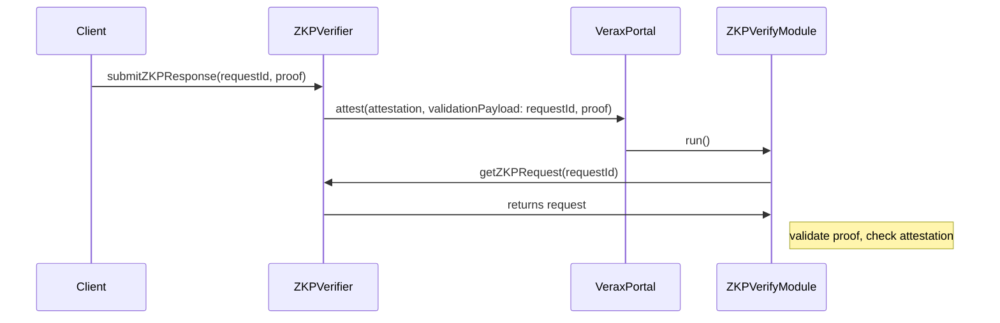
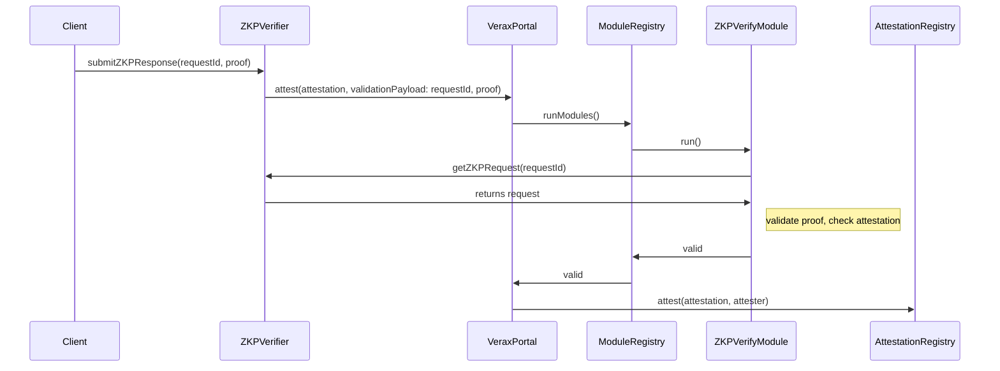

Full path:

1. npx hardhat run scripts/verax/deployVeraxZKPVerifier.ts --network sepolia
2. npx hardhat run scripts/verax/setRequests-v3validator-verax.ts --network sepolia (replace `veraxZKPVerifierAddress`)
3. npx hardhat run scripts/verax/deploy-module.ts --network sepolia (replace `VeraxZKPVerifier`)
4. npx ts-node scripts/verax/create-default-portal.ts  (replace `moduleAddress`)
5. npx hardhat run scripts/verax/setPortalInfo.ts --network sepolia (replace `veraxVerifierAddress` and `portalAddress`)

Check attestation on https://sepolia.lineascan.build/address/0xDaf3C3632327343f7df0Baad2dc9144fa4e1001F#events

npx ts-node scripts/verax/get-attestation.ts (replace `attestationId`)